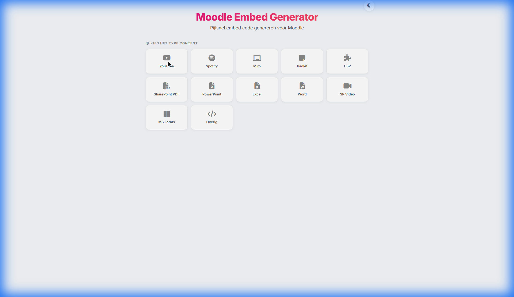
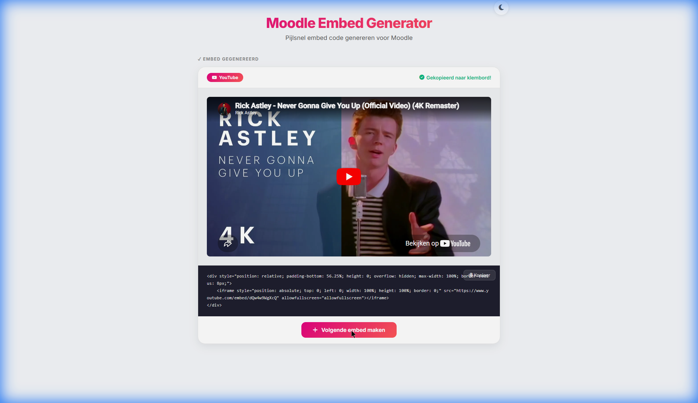
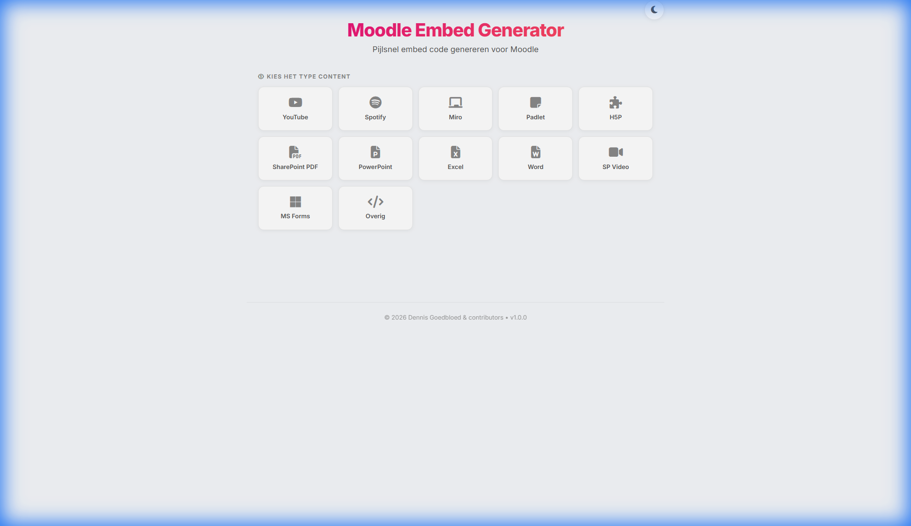

# Moodle Embed Generator

Een moderne, lichte en razendsnelle single-page web-applicatie om responsive, Moodle-veilige iframe embed code te genereren voor allerlei soorten content. Ontwikkeld om professionals die in Moodle werken te helpen pijlsnel en superintuïtief content in te sluiten zonder codeerskills.

Dit project bouwt voort op het fundament en de URL-parsing logica van de [Moodle Content Accordion Generator](https://github.com/inholland/moodle-content-accordion). In plaats van een complete accordeon genereert deze tool **één enkel responsive contentblok**.

---

## 🌟 Functies (Features)

- **UX ontworpen voor snelheid (Kies → Plak → Klaar)**: Direct na het genereren wordt de embed code automatisch naar het klembord gekopieerd. Met één druk op de "Volgende embed maken" knop begin je direct aan de volgende.
- **Slimme SharePoint URL Parsers**: Converteert SharePoint 'Sharing' en redirect links naar PDFs, Word-, Excel- en PowerPoint documenten automatisch naar direct embedded document viewers (`?web=1` en embed codes).
- **H5P & Miro Integratie**: Automatiseert de conversie van standaard Miro board URLs en H5P `view.php` Links naar hun respectievelijke embed varianten.
- **Moodle-safe HTML**: De gegenereerde HTML gebruikt uitsluitend inline styles (geen `<style>` blokken of onbekende CSS classes), om te voorkomen dat Moodle's Atto/TinyMCE editor de vormgeving stript.
- **Responsive by Design**: Maak gebruik van de ingebouwde aspect-ratio wrapper (`padding-bottom: 56.25%` en absolute positionering) om ervoor te zorgen dat iFrames soepel meeschalen met de schermgrootte van de Moodle cursist.
- **Automatische Titel Instructie**: Voegt automatisch een bijpassende en duidelijke `<h5>` instructietitel (zoals "Bekijk deze video:" of "Beluister deze podcast:") toe boven de ingesloten content.
- **Light & Dark Mode**: Een premium vormgegeven interface met een stijlvolle thema-toggle en Inholland Magenta accentkleuring.

---

## 📸 Screenshots

| Hoofdscherm (Light Theme) | Generatie Resultaat (Rick Roll) |
| :---: | :---: |
|  |  |

| Footer & Versieaanduiding |
| :---: |
|  |

---

## 📖 Gebruikershandleiding (User Guide)

1. **Start de Applicatie**: Open de tool in je browser (lokaal draaiend op [http://localhost:5173/](http://localhost:5173/)).
2. **Selecteer Content Type**: Klik op het type media dat je wilt embedden (bijvoorbeeld *YouTube*, *Miro* of *SharePoint PDF*).
3. **Plak de Bronlink**: Voer de URL of de complete iframe embed-code in het invoerveld in.
4. **Bevestig (Enter/Klik)**: Druk op Enter of klik op de genereerknop.
5. **Klaar!**: Het resultaat verschijnt direct in de live preview en de code is **automatisch gekopieerd** naar je klembord.
6. **Plakken in Moodle**:
   - Open de gewenste activiteit of pagina in Moodle en ga naar de bewerkingsmodus.
   - Open de HTML-weergave (`</>` icoon) in de tekst-editor.
   - Plak de code en sla de wijzigingen op.
7. **Volgende**: Klik op **Volgende embed maken** om direct terug te keren naar de selectiegrid.

---

## 🔗 Ondersteunde Content Types (12 Types)

| Type | Parser / Logica | Geprefixte Titel (`<h5>`) | Verwacht Resultaat |
| :--- | :--- | :--- | :--- |
| **YouTube** | `parseYoutube` | Bekijk deze video: | Responsive YouTube video embed |
| **Spotify** | `parseSpotify` | Beluister deze podcast: | Spotify podcast speler (152px weergave) |
| **Miro** | `parseMiro` | Bekijk dit Miro-bord: | Miro whiteboard embed |
| **Padlet** | `parsePadlet` | Bekijk dit Padlet-bord: | Padlet prikbord embed |
| **H5P** | `parseH5P` | Maak deze oefening: | H5P interactieve module iframe |
| **SharePoint PDF** | `parseSharePointPDF` | Lees dit document: | SharePoint PDF-viewer met "volledig scherm" link |
| **PowerPoint** | `parseSharePointPowerPoint` | Bekijk deze presentatie aandachtig: | Interactieve OneDrive PowerPoint dia-viewer |
| **Excel** | `parseSharePointExcel` | Bekijk dit spreadsheet: | OneDrive Excel online live viewer |
| **Word** | `parseSharePointWord` | Lees dit document: | OneDrive Word online document viewer |
| **SharePoint Video** | `parseSharePointVideo` | Bekijk deze video: | SharePoint / Stream browser video player |
| **MS Forms** | `parseMicrosoftForms` | Vul dit formulier in: | Microsoft Forms formulier iframe |
| **Overig** | `parseGenericEmbed` | Bekijk deze content: | Algemene iframe of url-viewer |

---

## 🛠️ Ontwikkelaarshandleiding (Developer Guide)

De applicatie is gebouwd met **React**, **Vite** en vanilla CSS.

### Vereisten

- [Node.js](https://nodejs.org/) (versie 18 of hoger aanbevolen)

### Installatie

Clone dit project naar je lokale machine en navigeer naar de projectmap:

```bash
cd moodle-embed-generator
npm install
```

### Lokaal Uitvoeren (Development Server)

Start de lokale Vite ontwikkelserver op:

```bash
npm run dev
```

De applicatie zal standaard te benaderen zijn op [http://localhost:5173/](http://localhost:5173/).

### Productie Build

Compileer de applicatie tot een geoptimaliseerde statische site in de `dist` map:

```bash
npm run build
```

---

## 📄 Licentie (License)

Dit project is gepubliceerd onder de [MIT License](LICENSE).
